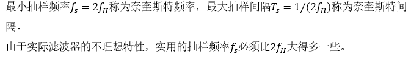

## `常见知识点`
```TXT
在信道编码中，定义码组中非零码元的数目为码组的重量，简称码重。一种编码的最小码距直接关系到这种码的检错和纠错能力，因此最小码距是信道编码的一个重要参数。```
```txt
PCM即脉码调制，它是一种将模拟语音信号变换成数字信号的编码方式。PCM主要包括抽样、量化和编码3个过程。抽样是信号在时间上的离散化。量化是信号在幅值上的离散化，量化电平数越多，量化噪声越小，量化信噪比越高。
```

```txt
数据库：是在计算机存储设备上存放一定格式数据的仓库，它长期存储在计算机内，并且有组织和可共享的数据集合。

数据库管理系统：是数据库系统的核心组成部分，它是介于用户与操作系统之间的一层数据管理软件，是用户和数据库的接口。采用数据库技术，实现数据独立于程序的统一管理。
数据库系统：是带有数据库的计算机系统，一般由数据库、数据库管理系统（及其开发工具）、相关的硬件、软件和各类人员组成。数据库系统的软件包括：DBMS、支持DBMS的操作系统、与数据库接口的高级语言和编译系统，以及以DBMS为核心的应用开发工具。各类人员包括数据库管理员、系统分析员和数据库设计人员，其中数据库管理员（Database Administrator，DBA）是负责数据库的建立、使用和维护的专门的人员。
```
```txt
联合检测技术在传统检测技术的基础上，充分利用造成多址干扰的所有用户信号及其多径的先验信息，把用户信号的分离当作一个统一的相互关联的联合检测过程来完成，从而具有优良的抗干扰性能，降低了系统对功率控制精度的要求，可以更加有效的利用上行链路频谱资源，显著提高系统容量，并削弱了“远近效应”的影响。
使用联合检测技术可以为系统带来的好处有：降低干扰、扩大容量、削弱“远近效应”的影响、降低功控的要求。
```
```
根据我国网络的实际情况，信令网采用3级结构。第1级HSTP间采用AB平面连接方式，是网状连接方式。
```


```TXT
计算机网络攻击的3大类：拒绝服务型攻击、扫描窥探攻击和畸形报文攻击。畸形报文攻击主要包括Ping of Death和Teardrop等。
```
```TXT
OSPF协议：是一个内部网关协议，用于在单一自治系统内决策路由。是对链路状态路由协议的一种实现，隶属内部网关协议（IGP），故运作于自治系统内部。著名的迪克斯彻（Dijkstra）算法被用来计算最短路径树。是一种典型的链路状态（Link-state）的路由协议，一般用于同一个路由域内。

IP协议 ：对数据包进行相应的寻址和选路

IP协议：当在专用网内部的一些主机本来已经分配到了本地IP地址（即仅在本专用网内使用的专用地址），但现在又想和因特网上的主机通信（并不需要加密）时，可使用NAT方法。

ICMP：网际差错控制协议 为IP提供差错报告，向发送IP数据包的主机汇报错误
```
```TXT
通信网在硬件设备方面的构成要素是交换设备、传输链路和终端设备。

交换设备是通信网的核心设备，主要完成呼叫处理、信令处理和操作维护管理等功能。

传输链路是信息的传输通道，一般包括线路接口设备、传输介质、交叉连接设备等。

终端设备也称为用户终端设备。最常见的终端设备有电话机、传真机、计算机、视频终端、多媒体终端等。
```


```
数据通信业务在《电信业务分类目录（2015年版）》中分为两类，编号分别为A14（第一类数据通信业务）和A24（第二类数据通信业务）。
数据通信业务是通过互联网、帧中继、异步转换模式网、X.25分组交换网、数字数据网等网络提供的各类数据传送业务。
第一类数据通信业务包括：互联网国际数据传送业务、互联网国内数据传送业务、互联网本地数据传送业务、国际数据通信业务。第二类数据通信业务包括：固定网国内数据传送业务。
```
```
噪声可以分为脉冲噪声、窄带噪声和起伏噪声3类。脉冲噪声不是普遍的持续存在的，对语音通信的影响也较小，但是对数字通信可能有较大影响。窄带噪声也是只存在于特定频率、特定时间和特定地点。所以它的影响是有限的。只有起伏噪声无处不在。所以在讨论噪声对于通信系统的影响时，主要是考虑起伏噪声，特别是热噪声的影响。
```
```
二进制只有两个数码“0”和“1”，任何形式的数据都要靠“0”和“1”来表示。为了能有效的表示和存储不同形式的数据，人们使用了不同的数据单位。
（1）位（bit）
计算机中所有的数据都是以二进制来表示的，一个二进制代码称为“1位”，记为“bit”。是计算机存储数据、表示数据的最小单位。
（2）字节（byte）
在存储二进制数据时，以8位二进制代码为一个单元存放在一起，称为“1个字节（byte）”，用“B”表示。字节是计算机处理数据的基本单位，即以字节为单位解释信息。
计算机存储器容量大小是以字节数来度量的。经常使用的单位有B、KB、MB、GB。
1 KB = 1 024 B = 210B
1 MB = 1 024 KB = 220 B
1 GB = 1 024 MB = 230 B
```

